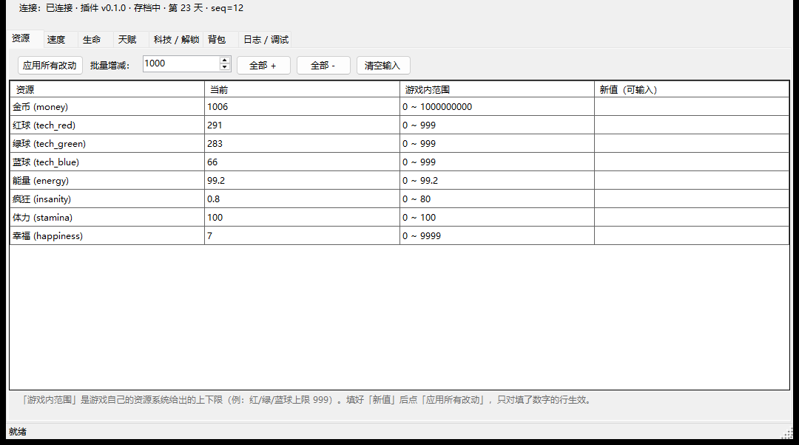
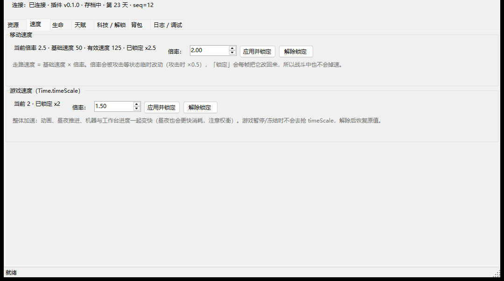
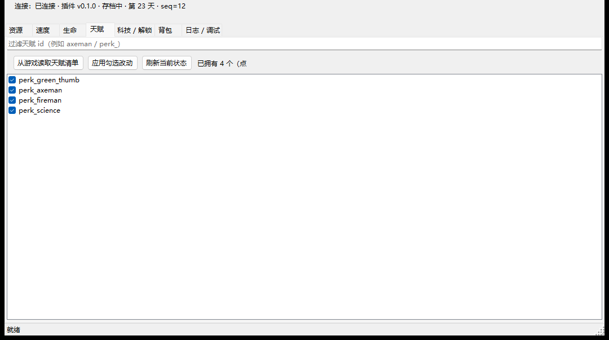
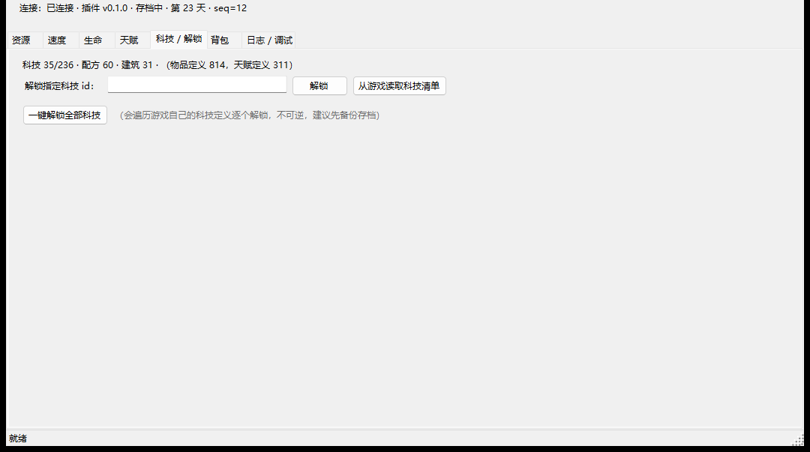

# GK2 Trainer · 守墓人 2 运行时修改器

[中文](README.md) | [English](README.en.md)

针对《守墓人 2》(Graveyard Keeper 2) 的**运行时数值修改器**：游戏跑着就能改金钱、红/绿/蓝球、
能量/疯狂/体力/幸福、生命值、移动速度、游戏速度、天赋、科技解锁和背包物品。

**[⬇ 下载最新版](../../releases/latest)** ·
[使用说明](#安装与使用) · [常见问题](#常见问题) · [逆向笔记](docs/recon.md)

- **直接调用游戏自己的接口**：金钱走 `PlayerData.SetRes("money", …)`（游戏自己的交易代码就这么写），
  天赋走 `PerkSystemData.AddPerk`，科技走 `KnowledgeSystem.UnlockTech`——不是猜地址、不是改显示。
- **游戏侧的插件只有 4 个 C# 文件**（约 25 KB），编译期直接引用游戏的 `Assembly-CSharp.dll`，
  一行反射都没有；改版后只要这些成员名字不变就照样能用。
- **资源上下限来自游戏自己**：红/绿/蓝球上限 999、金币上限 10 亿…界面里显示的"范围"就是游戏资源系统给的值。
- **速度修改带锁定**：移动速度和游戏速度都是"每帧重写"的锁定模式，战斗、暂停都不会把值改回去。
- **零手工依赖**：缺 BepInEx 时程序自己下载安装（选的是支持 Unity 6 的 5.4.23.5 + Doorstop 4.5）。



---

## 目录

- [它长什么样](#它长什么样)
- [能改什么](#能改什么)
- [工作原理](#工作原理)
- [安装与使用](#安装与使用)
- [常见问题](#常见问题)
- [从源码构建](#从源码构建)
- [项目结构](#项目结构)
- [致谢](#致谢)
- [免责声明](#免责声明)

---

## 它长什么样

左侧顶部是状态栏（游戏路径、BepInEx、插件、连接状态），下面是 7 个功能页。

**速度页**（本项目的特色）：移动速度和游戏速度分开，各自独立锁定。



- **移动速度** = 基础速度 × 倍率。游戏自己的攻击状态会把倍率改成 0.5（挥刀时走慢），
  「应用并锁定」会每帧把它改回来，所以战斗中也不掉速。想恢复就点「解除锁定」。
- **游戏速度** 直接控 `Time.timeScale`：动画、昼夜推进、机器进度一起加速。
  游戏暂停/冻结时不会去抢 `timeScale`，解除后恢复原值。

**天赋页**：点「从游戏读取天赋清单」会把游戏自己的 311 个天赋定义拉过来，搜索 + 勾选即可增删。



**科技页**：显示当前进度（例如已解锁 35/236），可以单个解锁，也可以一键全解锁（带不可逆确认）。



其余页面：**资源页**（8 种资源 + 游戏内真实上下限）、**生命页**（当前/上限、回满、伤害免疫开关）、
**背包页**（814 个物品定义里挑，按 id + 数量加入背包）、**日志/调试页**（插件日志、BepInEx 日志、探针）。

## 能改什么

| 分类 | 内容 | 游戏侧接口 |
|---|---|---|
| 资源 | 金币、红球、绿球、蓝球、能量、疯狂、体力、幸福（可增可减可设为） | `PlayerData.SetRes / AddRes / GetRes` |
| 移动速度 | 倍率 0.1–20（锁定，战斗不掉速） | `PlayerController.PhysicalBody.SpeedMultiplier` |
| 游戏速度 | 0.1–10（锁定，带暂停保护） | `Time.timeScale` |
| 生命 | 设为 / 回满 / 伤害免疫开关 | `PlayerData.hpComponent.Hp / MaxHpValue / IsImmuneToDamage` |
| 天赋 | 增删任意天赋（311 个定义可选） | `PerkSystemData.AddPerk / RemovePerk / HasPerk` |
| 科技 | 单个解锁 / 一键全解锁 | `KnowledgeSystem.UnlockTech` + `GameBalance.Me.techDefs` |
| 背包 | 按 id + 数量加物品（加前检查能否放下） | `Inventory.AddItemToInventory(new Item(id, count))` |

## 工作原理

```
┌──────────────────┐   command.json    ┌──────────────────────────────────────┐
│  GK2Trainer.exe  │ ────────────────► │  GraveyardKeeper2.exe                │
│  C# WinForms     │                   │   └─ BepInEx 5（自动安装）            │
│                  │ ◄──────────────── │        └─ GK2Trainer.Plugin.dll      │
└──────────────────┘    state.json     └──────────────────────────────────────┘
```

控制端只做三件事：显示界面、把操作翻译成命令、读写一个 JSON 文件；真正改数值的是**游戏进程内的插件**，
它调用游戏自己的公开 API 完成写入。

| 文件 | 方向 | 内容 |
|---|---|---|
| `Trainer\command.json` | 程序 → 游戏 | `{token, seq, ops:[…]}` |
| `Trainer\state.json` | 游戏 → 程序 | 全量状态 + **执行确认**（token/seq） |
| `Trainer\log.txt` | 游戏 → 程序 | 插件诊断日志 |

（都在 `%USERPROFILE%\AppData\LocalLow\Lazy Bear Games\Graveyard Keeper 2\` 下。）

两个设计点值得说明：

- **命令去重**：插件把"最后执行的 token/seq"写回状态文件。所以**读档之后不会把最后一条命令再执行一次**
  （这是这类工具最容易出的事故：读档后金币又加了一遍）。
- **锁定（freeze）**：移动速度/游戏速度这类会被游戏自己改动的值，插件每帧重写一次，
  并在游戏暂停时主动让位。

## 安装与使用

### 0. 环境

| 需要 | 说明 |
|---|---|
| 《守墓人 2》 | Unity 6000 + Mono（已在 **1.004.2** 上验证通过） |
| BepInEx 5 + UnityDoorstop | **程序会自动安装**（5.4.23.5，自带支持 Unity 6 的 Doorstop 4.5）。也可以手动装 |
| .NET | 用 Release 里的 exe **不需要**；从源码构建需要 .NET 10 SDK |

### 1. 运行修改器

下载 Release 里的 exe 双击运行。程序会**从运行中的游戏进程、已保存的设置、Steam 库**依次找游戏目录；
都不行就点「选择游戏目录…」手动指定 —— 装在别的盘、非 Steam 版同样能识别。

### 2. 装插件

点 **「安装 / 更新插件」**：缺 BepInEx 会先自动下载安装，然后把插件写进 `BepInEx\plugins\`。
之后**重启游戏**（插件在启动时加载）。

### 3. 开始修改

启动游戏 → **读取存档** → 回到修改器，顶部会显示
`连接：已连接 · 插件 v0.1.0 · 存档中 · 第 N 天 · seq=…`，这时所有功能都能用。

> - 改完立刻生效；资源类改动会随存档保存。
> - **一键解锁全部科技是不可逆的进度改动**，做之前建议备份存档。
> - 移动速度/游戏速度是"锁定"的：不想要了记得点「解除锁定」。

### 卸载

点「卸载插件」删除插件（BepInEx 本身保留）。想彻底卸载就手动删掉游戏根目录的
`BepInEx\`、`winhttp.dll`、`doorstop_config.ini`、`.doorstop_version`。

## 常见问题

**顶部一直显示"等待插件回应"**
1. 确认插件已安装（状态栏会显示 `插件：已部署且是最新`）；
2. 确认**重启过游戏** —— 插件只在启动时加载；
3. 确认游戏里**已经读取存档**（主菜单下没有可改的数据）。
4. 还不行就看「日志 / 调试」页：`BepInEx 日志` 里如果有 `Loading [GK2 Trainer Bridge …]` 说明插件加载了；
   插件自己的日志在 `Trainer\log.txt`。

**游戏起不来 / 黑屏闪退**
通常是 BepInEx/Doorstop 版本和 Unity 版本不匹配。本项目选的是已验证组合
（BepInEx 5.4.23.5 + Doorstop 4.5）。手动清理：删掉游戏根目录的 `BepInEx\`、`winhttp.dll`、
`doorstop_config.ini`、`.doorstop_version` 即可恢复原状。

**"游戏正在运行"时安装**
程序会把旧插件改名为 `*.dll.old` 再放新的（运行中的游戏把 dll 内存映射了，不能直接覆盖），
**下次启动游戏生效**。

**数值改了但游戏里没变化**
资源类改动是即时的；如果失败，「日志 / 调试」页会显示插件返回的错误（例如背包放不下、
不是玩家角色、值超范围）。也可以点 `游戏内探针（probe）` 看游戏侧的真实状态。

**修改器需要一直开着吗？**
不需要。它是"发命令"的：改完就可以关掉，游戏侧不受影响。锁定类的值（速度）在关掉程序后
仍然由插件维持。

## 从源码构建

```powershell
# 1. 插件（游戏侧）
dotnet build plugin\GK2Trainer.Plugin.csproj -c Release
#    游戏不在默认路径时： dotnet build plugin\GK2Trainer.Plugin.csproj -c Release -p:GameDir="D:\Games\Graveyard Keeper 2"

# 2. 控制端（会自动内嵌插件）
dotnet build src\GK2Trainer.App\GK2Trainer.App.csproj

# 3. 部署插件到游戏目录（游戏开着也能部署）
powershell -File tools\deploy.ps1

# 4. 打包发布
powershell -File tools\publish.ps1                 # 单文件 exe（需要 .NET 运行时）
powershell -File tools\publish.ps1 -SelfContained  # 完全独立版

# 5. 重新生成 README 截图（需要游戏在跑）
powershell -File tools\capture-screenshots.ps1
```

无界面命令（便于脚本化和排错）：

```powershell
GK2Trainer.exe diagnose                 # 环境自检 + 打印游戏侧状态
GK2Trainer.exe deploy                   # 安装 BepInEx + 部署插件
GK2Trainer.exe uninstall                # 删除插件
GK2Trainer.exe dump-state               # 打印游戏侧状态
GK2Trainer.exe op setRes name=money value=9999
GK2Trainer.exe op setMoveSpeed value=3
GK2Trainer.exe op listIds kind=perk limit=50
```

逆向过程与验证记录见 [`docs/recon.md`](docs/recon.md)（怎么从反编译结果里定位到这些接口、
哪些假设是真机验证过的）。

<details>
<summary>如果你的网络会阻断 git 传输</summary>

有些网络会把 `github.com:443` 的 git 传输重置掉（网页和 API 正常）。这种情况可以用
`tools\publish-via-api.ps1` 走 REST API 上传当前提交：

```powershell
$env:GH_TOKEN = '<带 repo 权限的 token>'
powershell -File tools\publish-via-api.ps1 -Owner <用户名> -Repo <仓库名>

# 发新版本（创建 Release 并上传构建产物）
powershell -File tools\create-release.ps1 -Owner <用户名> -Repo <仓库名> `
    -Tag v0.1.1 -Title "GK2 Trainer v0.1.1" -NotesFile notes.md `
    -Assets 'dist\GK2Trainer-v0.1.1.exe','dist\GK2Trainer-v0.1.1-standalone.zip'
```

脚本按 `git cat-file` 的原始字节上传每个文件，因此远端文件与本地逐字节一致（tree SHA 相同）；
只有提交对象自身的 SHA 可能不同，因为 GitHub 会去掉提交信息首尾的空白。
</details>

## 项目结构

```
├─ plugin/                         ← 注入游戏的 BepInEx 插件（游戏侧，C#）
│  ├─ Plugin.cs                    ← 入口：Tick 轮询、命令去重、锁定
│  ├─ Bridge.cs                    ← 文件桥、日志、原子写
│  ├─ Snapshot.cs                  ← 采集状态（资源/生命/速度/天赋/科技）
│  └─ Ops.cs                       ← 所有操作（改资源、速度、天赋、科技、背包）
├─ src/GK2Trainer.App/             ← C# WinForms 控制端
│  └─ Core/
│     ├─ Paths.cs                  ← 游戏目录探测（运行中进程 → 设置 → Steam 库）
│     ├─ PluginDeployer.cs         ← 部署插件 / 自动安装 BepInEx
│     ├─ Bridge.cs                 ← 命令队列、状态轮询、超时重发
│     ├─ Models.cs / LenientJson.cs← 协议 DTO + 宽容 JSON 解析
│     └─ Cli.cs                    ← 无界面命令
├─ tools/                          ← 部署、截图、打包脚本
└─ docs/recon.md                   ← 逆向笔记与真机验证记录
```

## 致谢

- **[BepInEx](https://github.com/BepInEx/BepInEx)**（LGPL-2.1）—— 插件加载器，
  本项目的插件依附于它；程序只在缺的时候引导/自动下载，**不随本项目分发**。
- **[UnityDoorstop](https://github.com/NeighTools/UnityDoorstop)**（MIT）—— BepInEx 5.4.23.5 已内置 4.5 版。
- **[Newtonsoft.Json](https://www.newtonsoft.com/json)**（MIT）—— 插件直接用游戏自带的那个 dll。
- **《守墓人 2》© Lazy Bear Games / tinyBuild** —— 本项目不包含任何游戏资源文件；
  物品/天赋/科技的 id 清单是**运行时从游戏自己的定义表里读出来的**，不随仓库分发。

## 免责声明

- 仅供**单机**学习与个人使用；请勿在联机或影响他人体验的场合使用。
- 改存档有风险，动手前建议备份：`%USERPROFILE%\AppData\LocalLow\Lazy Bear Games\Graveyard Keeper 2\`
  下的 `Steam_*.dat` / `.info`（游戏自己也会保留 3 个自动备份）。
- 本项目与 Lazy Bear Games、tinyBuild、BepInEx 作者均无隶属关系。
- 协议：[MIT](LICENSE)
